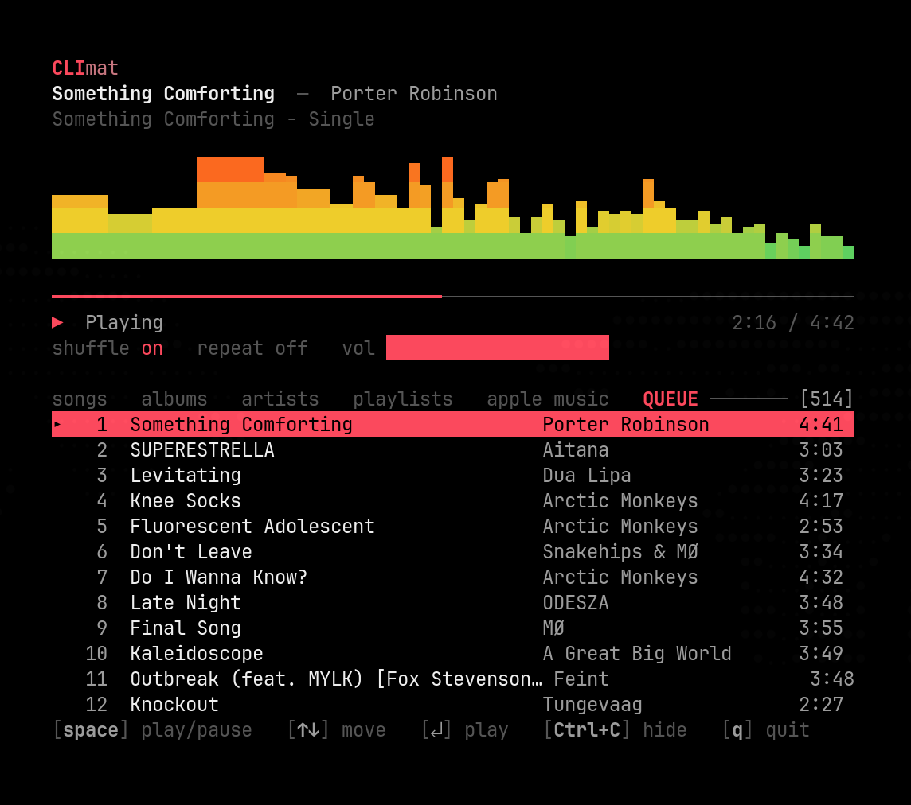

<!--
SPDX-FileCopyrightText: 2026 Miguel Rincon
SPDX-License-Identifier: GPL-3.0-or-later
-->

<p align="center">
  
</p>

# Slipmat

Apple Music for Linux with a native interface.

Apple does not ship a Linux client, and Widevine prevents a native audio stack.
Slipmat builds its interface in Rust and uses a hidden web engine to decode
audio. The GNOME app and terminal player share that engine.

<p align="center">
  
</p>

## What it does

- **Two native clients.** Use the GTK4 and libadwaita app or run `climat` in a
  terminal. Both control the same player state.
- **Your full library.** Browse and sort songs, albums, artists and playlists.
  Playing a list turns it into the queue.
- **Gapless playback.** Open the full-size player with its queue and artwork.
- **Desktop controls.** Control playback from the GNOME top bar, lock screen or
  media keys. Music keeps playing after you close the window.
- **Apple Music search.** Search for artists, albums, playlists and songs, then
  play from their detail pages.
- **Fast startup.** Slipmat opens on its cached library and restores the last
  queue without resuming playback.

<p align="center">
  
  <br>
  <sub>Climat, the terminal player</sub>
</p>

<table>
  <tr>
    <td colspan="2" width="33%">
      
    </td>
    <td colspan="2" width="33%">
      
    </td>
    <td colspan="2" width="33%">
      
    </td>
  </tr>
  <tr>
    <td colspan="2" align="center"><sub>Albums, sidebar collapsed</sub></td>
    <td colspan="2" align="center"><sub>Artists, portraits from the catalogue</sub></td>
    <td colspan="2" align="center"><sub>A playlist with a cover built from its tracks</sub></td>
  </tr>
  <tr>
    <td colspan="3" width="50%">
      
    </td>
    <td colspan="3" width="50%">
      
    </td>
  </tr>
  <tr>
    <td colspan="3" align="center"><sub>The player opened out, queue alongside</sub></td>
    <td colspan="3" align="center"><sub>Searching the whole catalogue</sub></td>
  </tr>
</table>

## Install

You need an **active Apple Music subscription** and **a network connection
whenever you play**. Linux Widevine cannot cache playback licences. The v0.11
release targets x86_64. Development builds for v0.12 support both x86_64 and
aarch64. See [Limitations](#limitations).

Each installation method downloads castLabs Electron once. Its Chromium bundle
uses about **200 MB**, and its component updater fetches the Widevine CDM on
first run.

### Arch and derivatives

```bash
yay -S slipmat        # latest release: the GNOME app
yay -S climat         # latest release: the terminal player
yay -S slipmat-git    # tracks main: the GNOME app
yay -S climat-git     # tracks main: the terminal player
```

Either client pulls in the shared playback daemon. The release and `-git`
packages conflict, following the AUR convention. `-git` packages build the
current `main` branch, which may contain unfinished work. The `-git` packages
support both x86_64 and aarch64. ARM64 users need them until v0.12 is released.

### Flatpak for any distribution

Download `Slipmat.flatpak` from the [latest
release](https://github.com/SoftARV/Slipmat/releases/latest), then:

```bash
flatpak install ./Slipmat.flatpak
flatpak run dev.miguelrincon.Slipmat
```

Starting with v0.12, choose `Slipmat-x86_64.flatpak` or
`Slipmat-aarch64.flatpak` to match your CPU.

A bundle contains the app but fetches its runtime during installation. Accept
the prompt to download GNOME 49 from Flathub. Declining it reports that the
matching `org.gnome.Platform` runtime was not found.
If your machine has no Flathub remote at all:

```bash
flatpak remote-add --if-not-exists --user flathub \
  https://dl.flathub.org/repo/flathub.flatpakrepo
```

Slipmat has no Flathub listing. Download its bundle from GitHub Releases.

The bundle includes the GNOME app, engine and sidecar. Install `climat` from the
AUR or build it from source.

### From source

```bash
sudo pacman -S --needed base-devel pkgconf rust gtk4 libadwaita librsvg \
                        nodejs npm libpulse
make install     # build + install to ~/.local, no sudo
```

The build requires Rust ≥ 1.93, the MSRV for relm4 0.11, and Node. I verified it
with Node 26. Launch **Slipmat** from the app grid or run `slipmat`. If your
shell cannot find that command, add `~/.local/bin` to your `PATH`.

`climat` installs alongside Slipmat and includes its own desktop entry. It opens
in a terminal but still needs a graphical session because the daemon runs
Chromium. A plain SSH connection to a headless machine cannot provide the
display server Chromium requires.

### First run

The first client you start opens Apple's sign-in window. The daemon hides it
after authentication and shares that session with both clients. Install the app
before testing notifications; GNOME needs its `.desktop` entry to display them.

## Limitations

The platform imposes these limitations:

- **No offline or downloaded playback.** Linux's Widevine CDM does not support
  persistent licences and reports `PLATFORM_UNVERIFIED`. Widevine must license
  each track over the network, so Slipmat cannot play offline.
- **~200 MB on disk for the sidecar.** The sidecar bundles Chromium to provide
  Widevine.
- **ARM64 ships with v0.12.** The v0.11 release remains x86_64-only. We verified
  the v0.12 development packages through first-run Widevine setup, Apple
  sign-in, library loading and playback as both an Arch Linux ARM package and a
  GNOME 49 Flatpak.
- **`climat` needs a desktop session.** Its daemon runs Chromium, which requires
  a display server even when it keeps the window hidden.
- **Apple can change `music.apple.com`.** Slipmat uses a small hook to drive
  MusicKit. If Apple changes that interface, Slipmat reports the error instead
  of leaving you at a spinner.
- **A few library tracks may be unplayable.** Apple delists tracks while leaving
  them in your library. Slipmat remembers failed tracks across sessions and
  dims them so they cannot break a queue.

Known bugs live in [the issue tracker](https://github.com/SoftARV/Slipmat/issues).

## How it works

Apple Music full tracks are HLS + **Widevine** DRM. On Linux the only Widevine
CDM comes with Chromium. WebKitGTK has no CDM, and GStreamer cannot decrypt the
stream. Slipmat therefore needs Chromium for audio decoding.

Slipmat uses three processes:

```
┌────────────────────────────┐   ┌────────────────────────────┐
│  Slipmat: GTK4/libadwaita  │   │  climat: the terminal      │  ← what you see
│  library · search · queue  │   │  same, drawn in text       │
└─────────────┬──────────────┘   └─────────────┬──────────────┘
              │      newline-delimited JSON over a Unix socket
              └──────────────┬─────────────────┘
┌────────────────────────────▼─────────────────────────────────┐
│  slipmatd: the engine                         ← no window     │
│  owns the queue · MPRIS · artwork · the library cache         │
│  HTTPS ──────────────────────────────► api.music.apple.com    │
└────────────────────────────┬─────────────────────────────────┘
                             │  the same JSON, over stdio
┌────────────────────────────▼─────────────────────────────────┐
│  sidecar: castLabs Electron                ← invisible        │
│  hidden music.apple.com  +  MusicKit  +  Widevine             │
│  → audio straight to PipeWire, untouched                      │
└───────────────────────────────────────────────────────────────┘
```

- **The daemon owns the sidecar.** Chromium permits one process to hold its
  profile lock, so both clients connect to the same engine and player state.
- **Clients manage the daemon.** The first client starts it. The daemon stops
  Chromium after five idle minutes and starts it when a client returns.
- **Rust handles the interface and metadata.** Slipmat uses Apple's REST API for
  browsing and search. The hidden Chromium window handles sign-in and audio.

Slipmat plays through Apple's own MusicKit player with Google's official CDM. It
provides native clients for that licensed session. Slipmat does not strip DRM,
use extracted CDMs or download tracks.

## Development

```bash
cargo run                                    # the GNOME app
cargo run -p climat                          # the terminal player
RUST_LOG=slipmatd=debug cargo run -p slipmatd   # the engine, with its protocol
make sidecar-run                             # sidecar alone, window VISIBLE
make gapless                                 # watch the audio stream across a boundary
cargo clippy --all-targets -- -D warnings    # the bar
make check                                   # fmt + clippy + test
```

Start debugging with `make sidecar-run`. A failure there points to DRM or Apple.
If the sidecar plays the track, inspect the daemon logs next.

Both clients reuse a running daemon. Run `pgrep -x slipmatd` before testing a
new daemon build so an older process does not mask your changes.

Module headers in `src/` describe each file's responsibility. Longer comments
record edge cases and measurements. Merged PRs contain the reasoning behind
each change.

## Related

[Sidra](https://github.com/wimpysworld/sidra) and [Cider](https://cider.sh)
pioneered the castLabs Electron approach for Apple Music on Linux. Slipmat uses
their groundwork with a different interface.

## Licence

GPL-3.0-or-later. See [COPYING](COPYING).
