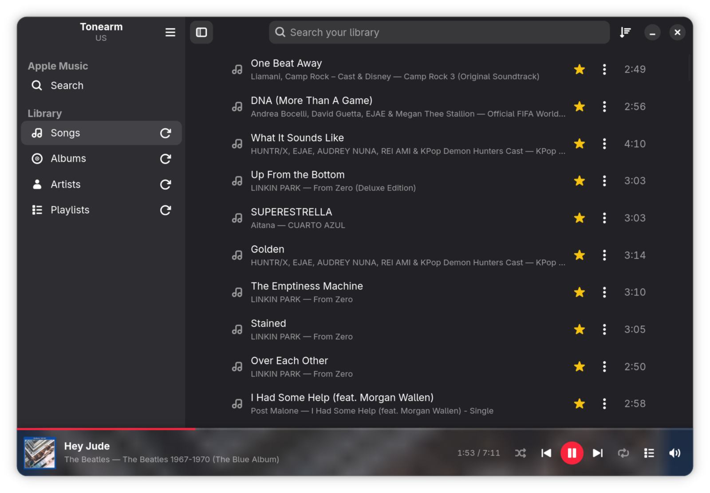
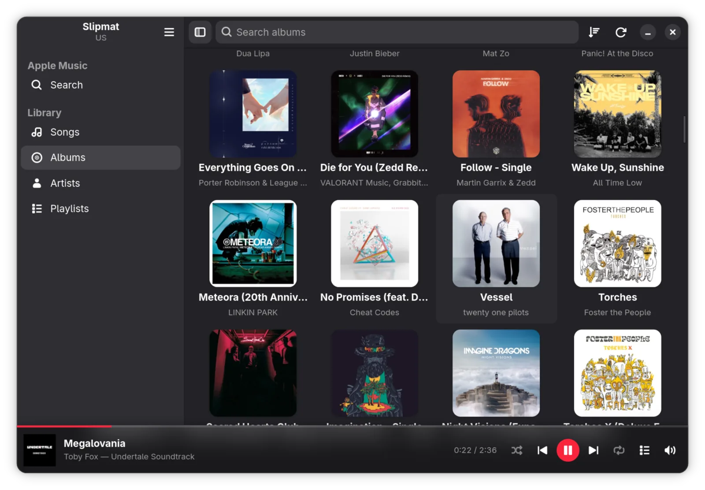
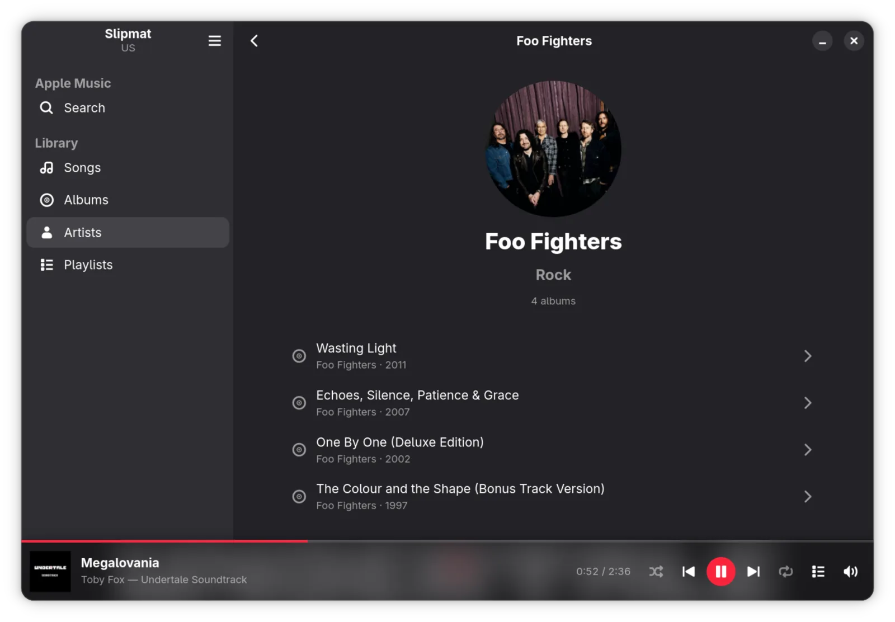
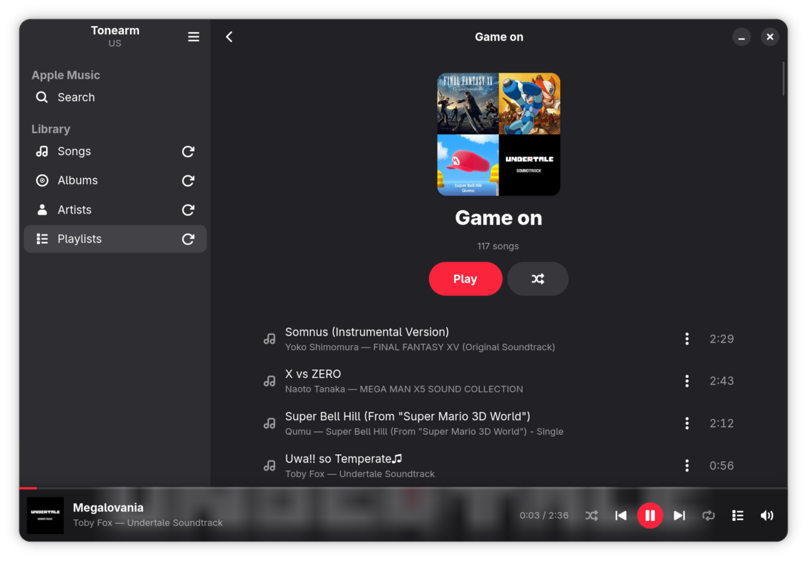
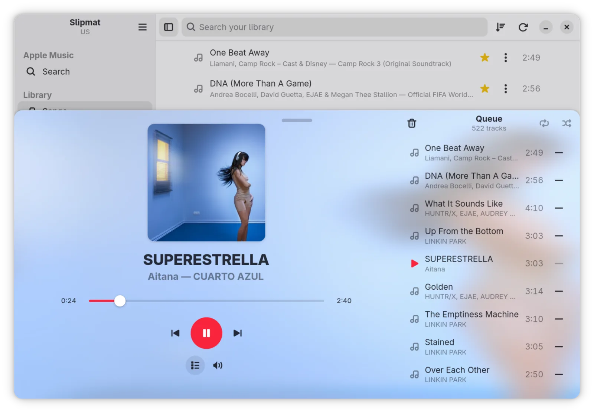
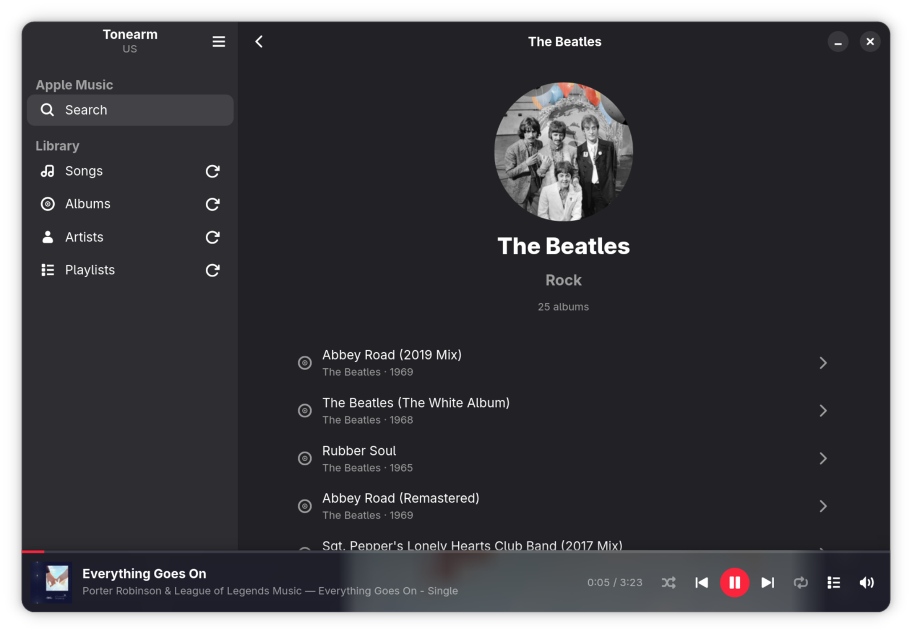

<!--
SPDX-FileCopyrightText: 2026 Miguel Rincon
SPDX-License-Identifier: GPL-3.0-or-later
-->

<p align="center">
  
</p>

# Slipmat

A native GNOME client for Apple Music.

Apple ships no Linux client, and the DRM makes a fully native one impossible —
so Slipmat draws its own interface in GTK4 and libadwaita, written in Rust, and
keeps the web engine strictly for decoding audio. Real lists, real GNOME search,
and media controls that answer from the top bar and the lock screen.

The web engine is still there. You just never see it.

<p align="center">
  
</p>

## What it does

**A native GNOME app.** GTK4 and libadwaita, written in Rust — real lists, real
keyboard navigation, a window that tiles to half a screen. There is a web layer,
because Apple's DRM leaves no choice, but it is one hidden process that decodes
audio and nothing else. You never see a web page.

**Your library.** Songs, albums, artists and playlists, each with type-to-find
filtering and its own sorting. Click anything and the list you are looking at
becomes the queue.

**A player worth the name.** Gapless, with a full-size view you can pull up, the
queue beside it, and the cover behind it. [Measured, not
hoped for](#gapless-verified).

**Controls where you already look.** Play, pause and skip from the GNOME top
bar, from the lock screen, or with your keyboard's media keys — cover and title
alongside them, and the position honest while it plays. Close the window and the
music keeps going; it quits when you tell it to, not when you tidy your desktop.

**All of Apple Music, searchable.** Artists, albums, playlists and songs in one
list, paginated as you scroll, each opening a page you can play from and drill
through.

**Quick, and out of the way.** It opens on your library rather than on a
spinner, a five-hundred-track list scrolls without stuttering, and whatever you
were playing is waiting next launch — restored, never resumed. An app that
starts making noise because you opened it is a hostile one.

<table>
  <tr>
    <td colspan="2" width="33%">
      
    </td>
    <td colspan="2" width="33%">
      
    </td>
    <td colspan="2" width="33%">
      
    </td>
  </tr>
  <tr>
    <td colspan="2" align="center"><sub>Albums, sidebar collapsed</sub></td>
    <td colspan="2" align="center"><sub>Artists, portraits from the catalogue</sub></td>
    <td colspan="2" align="center"><sub>A playlist — cover built from its tracks</sub></td>
  </tr>
  <tr>
    <td colspan="3" width="50%">
      
    </td>
    <td colspan="3" width="50%">
      
    </td>
  </tr>
  <tr>
    <td colspan="3" align="center"><sub>The player opened out, queue alongside</sub></td>
    <td colspan="3" align="center"><sub>Searching the whole catalogue</sub></td>
  </tr>
</table>

## Install

You need an **active Apple Music subscription**, an **x86_64** machine (Widevine
on Linux is x86_64 only), and **a network connection every time you play** —
that last one is permanent, not a limitation we intend to lift. See
[Limitations](#limitations).

Every route fetches castLabs Electron once — **about 200 MB of Chromium**. That
is the Widevine boundary and there is no smaller version of it.

### Arch and derivatives

Both packages are on the AUR:

```bash
yay -S slipmat        # the latest release
yay -S slipmat-git    # tracks main
```

They conflict with each other, as the convention requires. `slipmat-git`
rebuilds from whatever is on `main`, so it picks up unreleased work — including
anything half-finished.

### Flatpak — any distribution

Slipmat needs libadwaita ≥ 1.8 and GTK ≥ 4.20, which rules out Debian stable,
Ubuntu 24.04 and Fedora ≤ 42. **The Flatpak carries the GNOME 49 runtime with
it, so your system's libadwaita stops mattering** — verified from nothing on a
stock Ubuntu 25.10, which cannot build Slipmat at all.

Download `Slipmat.flatpak` from the [latest
release](https://github.com/SoftARV/Slipmat/releases/latest), then:

```bash
flatpak install ./Slipmat.flatpak
flatpak run dev.miguelrincon.Slipmat
```

A bundle carries the app and **not** the runtime it sits on, so the install
offers to fetch GNOME 49 from Flathub the first time. Answer yes, or it stops
with *"requires the runtime org.gnome.Platform/x86_64/49 which was not found"*.
If your machine has no Flathub remote at all:

```bash
flatpak remote-add --if-not-exists --user flathub \
  https://dl.flathub.org/repo/flathub.flatpakrepo
```

It is **not on Flathub** and is not intended to be.

### From source

```bash
sudo pacman -S --needed base-devel pkgconf rust gtk4 libadwaita librsvg nodejs npm
make install     # build + install to ~/.local, no sudo
```

Also needs Rust ≥ 1.93 (relm4 0.11's MSRV) and Node — verified on Node 26. Then
launch **Slipmat** from the app grid, or run `slipmat`. If that command is not
found, `~/.local/bin` is not on your `PATH`.

### First run

Apple's own sign-in window opens once, and hides for good after you
authenticate. Notifications need the app to be installed — running from a build
tree, the shell has no `.desktop` entry to attach them to.

## Support

Slipmat is free, GPL-3, and stays that way. It is also a spare-time project for
one Linux laptop that other people happen to find useful.

If it earns a place on yours:

[](https://ko-fi.com/miguelrincon)

## Limitations

These are properties of the platform, not a to-do list:

- **No offline or downloaded playback.** Linux's Widevine CDM does not support
  persistent licences (it reports `PLATFORM_UNVERIFIED`), so every track must be
  licensed live. Slipmat cannot work on a plane.
- **~200 MB on disk for the sidecar.** It is a full Chromium. That is the cost
  of the only CDM that exists.
- **x86_64 only.** No ARM Widevine on Linux.
- **Apple can change `music.apple.com`.** The hook that drives MusicKit is small
  and defensive, but it is the one surface outside our control. If Apple moves
  something, Slipmat says so rather than silently spinning.
- **A few library tracks may be unplayable.** Apple delists tracks while leaving
  them in your library. Slipmat finds them on first attempt, remembers them
  across sessions, and dims them rather than letting one break a queue.

Known bugs live in [the issue tracker](https://github.com/SoftARV/Slipmat/issues).

## How it works, honestly

Apple Music full tracks are HLS + **Widevine** DRM. On Linux the only Widevine
CDM that exists is the one Google ships inside Chromium. There is no way around
that — WebKitGTK has no CDM, and GStreamer cannot decrypt the stream. **A 100%
native Apple Music player cannot be built.**

So Slipmat splits the problem:

```
┌──────────────────────────────────────────────────┐
│  Slipmat — Rust · relm4 · libadwaita             │  ← everything you see
│  library · search · queue · Now Playing          │
│  MPRIS · notifications · media keys · artwork    │
│  HTTPS ─────────────────► api.music.apple.com    │
└───────────────────────┬──────────────────────────┘
                        │  newline-delimited JSON over stdio
┌───────────────────────▼──────────────────────────┐
│  sidecar — castLabs Electron                      │  ← invisible after login
│  hidden music.apple.com  +  MusicKit  +  Widevine │
│  → audio straight to PipeWire, untouched          │
└───────────────────────────────────────────────────┘
```

All browsing, search and metadata is native code talking to Apple's REST API and
drawing native widgets. Only the **audio decode** happens in the sidecar — a
Chromium window with `show: false`, displayed exactly once for Apple's own
sign-in and then never again. It is never rendered, it does not appear in the
dash, and it does not publish an MPRIS player of its own.

Slipmat plays through Apple's own MusicKit player with Google's official CDM. It
is a native front-end and a remote control for a licensed session. It does not
strip DRM, does not use extracted CDMs, and does not download anything.

## Gapless, verified

Verified 2026-07-26 across four consecutive boundaries of a segued album:

- Every transition happened **unprompted** — Slipmat sent nothing at any
  boundary. MusicKit advanced a queue it already held, which is the only way the
  transition can be seamless.
- Wall-clock between transitions matched each track's length to the second, so
  no track was cut short.
- The PipeWire stream was **created once and never torn down**. One sink-input
  survived all four boundaries, which means the decoder ran continuously.
- No audible gap.

## Development

```bash
cargo run                                    # dev
RUST_LOG=slipmat=debug cargo run             # trace the sidecar protocol
make sidecar-run                             # sidecar alone, window VISIBLE
make gapless                                 # watch the audio stream across a boundary
cargo clippy --all-targets -- -D warnings    # the bar
make check                                   # fmt + clippy + test
```

Debug in layers — `make sidecar-run` first. If a track won't play with the
window visible, the problem is DRM or Apple, not Rust.

See [CLAUDE.md](CLAUDE.md) for the full architecture, the rules the code
follows, and the traps that cost real debugging time.

## Related

Slipmat is the third in a series of native GNOME apps: **Dockyard** (Docker) and
**Pitwall** (GitHub Actions).

Prior art worth crediting: [Sidra](https://github.com/wimpysworld/sidra) and
[Cider](https://cider.sh) worked out the castLabs Electron path first, which is
what makes any of this possible on Linux. They take a different approach to the
interface; Slipmat would not exist without the groundwork.

## Licence

GPL-3.0-or-later. See [COPYING](COPYING).
